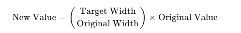

## What I newly learned while building this project:
1. **Using Google Fonts with CSS Variables:**
    * Before, I would import Google Fonts and apply them using a class like this:
    ```
      /* style.css */
      @import url('https://fonts.googleapis.com/css2?family=Quicksand:wght@300..700&display=swap');

      .quicksand {
        font-family: "Quicksand", sans-serif;
        font-optical-sizing: auto;
        font-weight: normal;
        font-style: normal;
      }
    ```
    ```
      <!--index.html-->
      <body class="quicksand"></body>
    ```
    * In this project, I learned how to use goggle  font using CSS variables.
    ```
    /* style.css */
    @import url('https://fonts.googleapis.com/css2?family=Quicksand:wght@300..700&display=swap');

    :root{
      --font-primary: "Quicksand", sans-serif;
    }

    body{
      font-family: var(--font-primary);
      font-optical-sizing: auto;
      font-weight: normal;
      font-style: normal;
    }
    ```
    I also use CSS variable for defining font weight and size:
    ```
    --card_paragraph_font_size: 1rem;
    --font-weight1: 500;
    --font-weight2: 600;
    --font-weight3: 700;
    ```
<br>

2. **Using law to find perfect sized based on figma to different screen:**
<br>