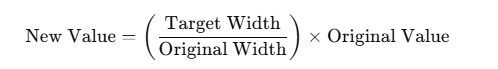

https://github.com/user-attachments/assets/47e6b553-ab5e-46c0-aaca-a4f1c957c214
# Project Name: Kids-Education

# Project Description:
This is a responsive project built using HTML and CSS. In my previous five projects (web_project1 to web_project5), I learned how CSS Flexbox and Grid work. However, in this project, I focused on media queries to make the website responsive. While applying my knowledge, I faced several challenges, which led me to relearn media queries and refine my understanding.

# Live Site Link:
https://muhammad-tamim.github.io/web_project6/

# Project Demo Video: 
https://github.com/user-attachments/assets/4fcf4154-334e-454f-9a6d-5ad2541d3b56

# What I newly learned while building this project:
1. **Using Google Fonts with CSS Variables:**
    * Before this project,  I used Google Fonts by applying them directly to elements via classes like this:
    ```
      /* style.css */
      @import url('https://fonts.googleapis.com/css2?family=Quicksand:wght@300..700&display=swap');

      .quicksand {
        font-family: "Quicksand", sans-serif;
        font-optical-sizing: auto;
        font-weight: normal;
        font-style: normal;
      }
    ```
    ```
      <!--index.html-->
      <body class="quicksand"></body>
    ```
    * In this project, I learned how to use goggle font using CSS variables.
    ```
    /* style.css */
    @import url('https://fonts.googleapis.com/css2?family=Quicksand:wght@300..700&display=swap');

    :root{
      --font-primary: "Quicksand", sans-serif;
    }

    body{
      font-family: var(--font-primary);
      font-optical-sizing: auto;
      font-weight: normal;
      font-style: normal;
    }
    ```
    Additionally, I used CSS variables to define font weight and sizes for better maintainability::
    ```
    --card_paragraph_font_size: 1rem;
    --font-weight1: 500;
    --font-weight2: 600;
    --font-weight3: 700;
    ```
<br>

2. **Using a Formula to Determine the Perfect Size Based on Figma Design:**
    

    My Figma design was created for a 2K (1440px) resolution, so I used a specific method to adjust sizes dynamically for different screen sizes.

4. **Using VS Code Emmet Abbreviations**
   
    Throughout this project, I heavily used Emmet abbreviations to speed up my workflow. 

    ```
      <!-- body -->
      header+main+footer
      <!-- header -->
      (section#nav_section>nav)+(section#banner_section)

      <!-- nav container -->
      (div>(div>img)+div)+(div>(p>a)*4)+div>button

      <!-- banner section -->
      div>((div>(h1+p+div>button))+div>img)

      <!-- main -->
      section#standard_curriculum_section+section#our_stories_section

      <!-- standard curriculum section -->
      div>(div>h2{Standard Curriculum})+(div>((div>((div>img)+h3+p+div>a))*3))+div>(div>(p*2))

      <!-- our stories section -->
      h1+div>((div>(div>img+p)+div>(h2+p))+div>(div>(div>img+p)+h3)*4)

      <!-- footer section -->
      div>(div>(div>(div>img)+h2)+p)+(div>h3+div>(p>a)*4)+(div>h3+div>p*4)
    ```

# FInal Thoughts
Thank you so much for checking out my project!
If you have any suggestions or feedback, feel free to share them.
